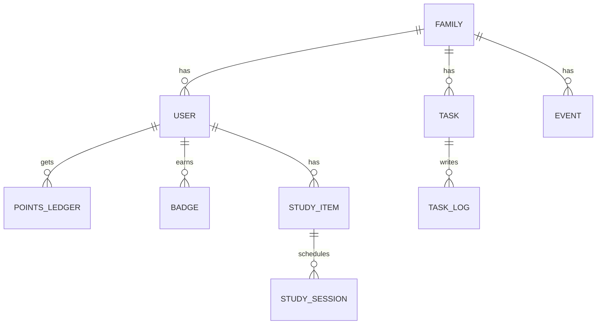

# AI Gezinplanner & Huishoudtaken – PRD v2.1 (Ultra-Detail, Single Codebase)

> **Status:** Definitief – klaar voor implementatie  
> **Auteur:** Werkruimte van Daan v. No (@info)  
> **Datum:** 10-11-2025  
> **Productnaam (werktitel):** **FamQuest** (veranderbaar)  
> **Platforms:** iOS, Android, Web (PWA) – **één codebase met Flutter/Dart**  
> **Kern-USB’s:** AI-planning, gamification per doelgroep (jongens/meisjes/tieners/pubers/ouders), vision schoonmaaktips (foto→advies), voice-intents, huiswerkcoach, offline-first, kiosk-modus, meertaligheid, SSO-inlog (Apple/Google/Microsoft/Facebook) + e-mail + 2FA.

---

## 0. Executive Summary

**Probleem:** Gezinnen missen één plek met **planning + huishoudtaken + motivatie**. De mentale last ligt vaak bij één ouder; kinderen missen motivatie en structuur.  
**Oplossing:** Een AI-gestuurde gezinsplanner met **gedeelde kalender, taken, beloningen, AI-huiswerkcoach** en **foto→schoonmaaktips**, compleet met **voice**, **offline**, **kiosk** en **meertalige** UI.  
**Differentiators:**  
- **All-in-one**: kalender + chores + gamification + AI in één app.  
- **Single codebase (Flutter)**: iOS/Android/Web identieke UX, lage onderhoudskosten.  
- **Gamification op maat** per doelgroep (jongens/meisjes/tieners/pubers/ouders).  
- **Rol “Externe Hulp”** (schoonmaakster) met beperkte toegang.  
- **SSO + e-mail login + 2FA**, privacy-by-design, AVG/COPPA-aware.

**Succes-KPI’s (12m):** DAU/MAU ≥ 0,55 • Churn < 2%/mnd • 75% taken on-time • 60% kinderen met ≥3-daagse streak/week • NPS ≥ +45 • Premium conversie ≥ 4%

---

## 1. Doelen, Niet-Doelen, OKR’s

### 1.1 Productdoelen
- **PD-1:** Verminder mentale load ouders via AI-planner & transparantie.
- **PD-2:** Verhoog intrinsieke motivatie kinderen (streaks, beloningen).
- **PD-3:** Eerlijke verdeling huishoudtaken (fairness-engine + inzichten).
- **PD-4:** Brede adoptie (gratis, kindveilige ads) + duurzame inkomsten (Family Unlock + Premium).
- **PD-5:** Toegankelijk en leuk: multi-thema, kiosk, voice, pictogrammen.

### 1.2 Niet-Doelen (v2.1)
- Geen publieke community/fora; gezin is besloten context.
- Geen directe geldbetalingen/zakgeld via bank in v2.1 (kan v3).
- Geen school-SIS integraties (post-MVP).

### 1.3 OKR’s (H1 & H2)
```yaml
objectives:
  - name: Verhoog taakafronding en motivatie
    key_results:
      - 75% van toegewezen taken op tijd afgerond
      - 60% kinderen met streak ≥3 dagen/week
      - 40% minder ouderlijke "reminders" (survey)
  - name: Stabiele groei en retentie
    key_results:
      - WAU/MAU ≥ 0,55
      - churn < 2% / maand
      - NPS ≥ +45
  - name: Monetisatie zonder frictie
    key_results:
      - 4% premium conversie
      - 35% kiest Family Unlock binnen 30 dagen
```

---

## 2. Persona’s, Motivaties, Journey Maps

### 2.1 Persona’s (kern)

**Ouder/Hoofdregelaar – “Eva”, 37**  
- HR-manager, 3 kinderen (6/9/12).  
- Doel: minder mentale last, eerlijk takenbord, snel overzicht.  
- Frictie: alles versnipperd (appjes, papieren lijstjes).  
- Thema: Minimal/Classy.  
- KPI’s (value): minder reminders, wekelijkse rust, iedereen draagt bij.

**Partner – “Mark”, 39**  
- Doel: alleen “mijne dingen” snel zien/doen, geen overload.  
- Thema: Minimal; push alleen voor eigen items.

**Kind – “Noah”, 10 (jongen)**  
- Doel: punten scoren, badges, competitie, avatars.  
- Thema: Blauw/Space; korte taken, snelle feedback.

**Kind – “Luna”, 8 (meisje)**  
- Doel: stickers, spaarkaart, personalisatie (kleuren/outfits).  
- Thema: Roze/Cartoony; beloningen met verbeelding (dieren/feeën).

**Tiener – “Sam”, 15 (puber)**  
- Doel: autonomie, strak design, streaks/challenges, data-inzicht.  
- Thema: Minimal/Dark; minder toon van “kinderapp”.

**Externe hulp – “Mira”, 45 (schoonmaakster)**  
- Doel: duidelijke lijst, afmelden, evt. foto upload.  
- Thema: Minimal; enkel toegewezen taken zichtbaar.

### 2.2 Gedragsmotivaties (samenvatting)
- **Kinderen 6–10:** direct belonen, visueel, avatars, stickers, korte feedback loops.  
- **Jongens 10–15:** competitie, challenges, levels/tiers (brons/zilver/goud), tijd-trials.  
- **Meisjes 10–15:** personalisatie, collectie-stickers, spaarkaarten, esthetische beloningen.  
- **Tieners 15+:** autonomie, streaks, challenges (weekly quests), minimal feedback.  
- **Ouders:** rust, inzicht, fairness-data, configuratiecontrole.

### 2.3 Journey Maps (dagtype voorbeeld)
```yaml
morning_routine:
  steps:
    - wake_up: kiosk toont "Vandaag" + eigen taken (pictogrammen voor kids)
    - breakfast: ouder ziet pending taken; AI-nudge “korte taken eerst”
    - school_departure: push: “Neem gymtas mee” (event tag school)
evening_routine:
  steps:
    - homework: AI-huiswerkcoach 20m sessie + micro-quiz
    - chores: 1–2 snelle taken; beloning/animatie direct zichtbaar
    - family_summary: parent digest: wie deed wat, streak guard @20:00
```

---

## 3. Scope, Prioriteiten, Releaseplan

### 3.1 Scope Matrix (MVP → Phase 2 → Later → OOS)
```yaml
mvp:
  - kalender (maand/week/dag)
  - takenbord + roulatie + claim
  - gamification (punten, badges, streaks, shop basic)
  - AI planner (voorstellen), vision tips (v1), voice intents (v1)
  - huiswerkcoach (v1: sessions + micro-quiz)
  - rollen: ouder/kind/tiener/schoonmaakster
  - offline-first + sync + kiosk PWA
  - SSO (Apple/Google/MS/Facebook) + e-mail + 2FA
  - i18n: NL/EN/DE/FR/TR/PL/AR (RTL)
phase2:
  - teamdoelen/quests, advanced fairness, analytics deep-dive
  - calendar subscribe (Google/Outlook), ICS import
  - themapacks + seasonals, avatar marketplace (virtueel)
later:
  - smart home triggers, bank/zakgeld koppelingen
  - school-SIS integraties, community
out_of_scope_now:
  - publieke social features
```

### 3.2 MoSCoW Prioritering
- **Must:** kalender, taken, gamification basic, AI planner, offline, SSO+2FA, i18n, kiosk.  
- **Should:** huiswerkcoach v1, vision v1, voice v1, externe hulp rol, shop-rewards.  
- **Could:** teamdoelen, season-themes, deep analytics, ICS import.  
- **Won’t (v2.1):** bankbetalingen, publieke community.

### 3.3 Risico’s & Mitigaties
```yaml
risks:
  ai_latency: "Trage AI responses"
  mitigation: "cachen, progressive UI, model-switch via OpenRouter"
  privacy_children: "AVG/COPPA naleving"
  mitigation: "PII-minimalisatie, ouder-consent, lokale storage encrypted"
  abuse_points: "Cheaten met snel afvinken"
  mitigation: "photoRequired, rate-limits, parentApproval heuristics"
  overscheduling: "Teveel taken op 1 dag"
  mitigation: "AI load balancer + parent override"
```

### 3.4 Releaseplan
```yaml
alpha_pwa: "Interne test (10 gezinnen) – kiosk, taken, gamification"
beta_apps: "TestFlight/Play Beta (20–50 gezinnen) – AI v1, i18n, SSO"
launch: "App Stores + Web (v2.1) – premium, marketing site live"
```

---

## 4. Informatiearchitectuur & Datamodel

### 4.1 Entiteiten (kern)


```json
{
  "User": {
    "id": "uuid",
    "familyId": "uuid",
    "role": "parent|teen|child|helper",
    "displayName": "string",
    "avatar": "url|preset",
    "locale": "nl|en|de|fr|tr|pl|ar",
    "theme": "cartoony|minimal|classy|dark|custom",
    "permissions": {
      "childCanCreateTasks": true,
      "childCanCreateStudyItems": true
    },
    "sso": {
      "providers": ["apple", "google", "microsoft", "facebook"],
      "email": "string",
      "emailVerified": true,
      "2faEnabled": true
    },
    "createdAt": "iso",
    "updatedAt": "iso"
  },
  "Task": {
    "id": "uuid",
    "familyId": "uuid",
    "title": "string",
    "desc": "string",
    "category": "cleaning|care|pet|homework|other",
    "frequency": "none|daily|weekly|cron",
    "due": "iso",
    "assignees": ["uuid"],
    "claimable": false,
    "points": 10,
    "photoRequired": false,
    "parentApproval": false,
    "status": "open|pendingApproval|done",
    "proofPhotos": ["url"],
    "priority": "low|med|high",
    "estDuration": 15,
    "createdBy": "uuid",
    "updatedAt": "iso"
  }
}
```

### 4.2 Access Control Matrix (uittreksel)
```yaml
roles:
  parent:
    can:
      - create/update/delete:any task|event
      - approve:task
      - manage:rewards, themes, permissions
  teen:
    can:
      - view:family tasks/events
      - create:own study items
      - complete:assigned tasks
  child:
    can:
      - view:own tasks
      - complete:assigned tasks
    configurable:
      - create:own tasks (parent toggle)
  helper:
    can:
      - view:assigned tasks only
      - complete:assigned tasks (photo optional)
```

---

## 5. Functionaliteit per Module (diepgaand)

### 5.1 Kalender
- Maand/Week/Dag/Agenda-lijst, kleur per gebruiker, filter.  
- ICS export, Google/Outlook read-only subscribe (phase2).  
- Kiosk: `/kiosk/today` & `/kiosk/week`, PIN-exit, auto-refresh.

### 5.2 Taken
- Eenmalig/terugkerend (RRULE/cron), roulatie (round-robin/fairness/manual).  
- Claimbare pool, TTL lock 10m.  
- Afvinken → animatie, punten; optioneel foto + ouder-approve.  
- Overdue handling + nudge; herplannen.  
- Historie & analytics (per user & gezin).

### 5.3 Gamification (per doelgroep)
```yaml
segments:
  kids_6_10:
    visuals: "cartoony, grote iconen, geluidjes"
    rewards: "stickers, avatar goodies"
    loops: "korte taken + directe animatie"
  boys_10_15:
    visuals: "space/tech, levels/tiers"
    rewards: "badges, speed-run, leaderboard"
    loops: "challenges, time-trials, quests"
  girls_10_15:
    visuals: "stijlvoller pastel/roze, collectie-stickers"
    rewards: "spaarkaarten, avatar custom, thema-unlocks"
    loops: "collect/completion sets, combo-bonussen"
  teens_15_plus:
    visuals: "minimal/dark, weinig franje"
    rewards: "streaks, weekly challenges, data-insight"
    loops: "autonomie, milestones, opt-in competition"
  parents:
    visuals: "minimal/classy"
    rewards: "fairness-insights, calm dashboards"
    loops: "AI-planning, minder reminders, digest mails"
```

**Economy en anti-cheat**
```yaml
points:
  base: 10
  multipliers:
    on_time: 1.2
    quality_approve_4star: 1.1
    streak_week: 1.1
    overdue_penalty: 0.8
anti_cheat:
  min_interval_sec: 30
  photo_required_on_pattern: true
  parent_approval_on_flag: true
```

### 5.4 Huiswerkcoach
- Invoer: vak, toetsdatum, topics.  
- AI backward planning → sessies (20–30m), reminders, ouder-overhoor.  
- Micro-quiz: 3–5 vragen/dag, spaced repetition, adaptief.

### 5.5 Vision (foto→schoonmaaktips)
- Detect: oppervlak (glas/hout/textiel), vlektype (vet/kalk/inkt/bloed).  
- Output: stappenplan, middelen (huismiddel eerst), waarschuwingen, tijd/score.  
- Disclaimers chemie, ouderlijk toezicht.

### 5.6 Voice & NLU
- Voice intents NL/EN/DE/FR/TR/PL/AR.  
- Voorbeelden: “Maak taak stofzuigen morgen 17:00”, “Markeer hond uitlaten klaar”, “Wat moet ik nu doen?”.  
- Pipeline: ASR → NLU intent → confirm/execute → TTS feedback.

---

## 6. AI via OpenRouter (architectuur)

### 6.1 Services
```yaml
ai_services:
  planner_llm: "LLM voor taakverdeling + weekschema"
  vision_tips: "Vision voor foto-analyse schoonmaak"
  voice_stt_tts: "Speech-to-text & Text-to-speech"
  nlu_intent: "Intent parsing / slot filling"
  study_coach: "Huiswerkplan + quiz generator"
broker: "OpenRouter – model multiplexing, fallbacks, quotas"
```

### 6.2 Planner Output (JSON)
```json
{
  "weekPlan": [
    {
      "date": "2025-11-17",
      "tasks": [
        { "title": "Vaatwasser", "assignee": "uuid-noah", "due": "2025-11-17T19:00:00Z" },
        { "title": "Stofzuigen", "assignee": "uuid-luna", "due": "2025-11-17T18:00:00Z" }
      ]
    }
  ],
  "fairness": {
    "distribution": { "noah": 0.28, "luna": 0.24, "sam": 0.22, "eva": 0.13, "mark": 0.13 },
    "notes": "balans op leeftijd/agenda, minder load op training-dagen"
  }
}
```

### 6.3 Vision Output (JSON)
```json
{
  "detected": { "surface": "glass", "stain": "limescale" },
  "steps": [
    "Meng lauw water met een scheutje azijn",
    "Gebruik microvezeldoek, wring goed uit",
    "Droog na met krant of droge doek"
  ],
  "warnings": ["Niet combineren met bleek"],
  "estimatedMinutes": 12,
  "difficulty": 2
}
```

---

## 7. i18n & RTL

```yaml
locales:
  - nl
  - en
  - de
  - fr
  - tr
  - pl
  - ar # RTL
rtl_locales: ["ar"]
per_profile_language: true
icu_messageformat: true
```

---

## 8. Offline-First & Sync

```yaml
storage:
  local: "Hive (Flutter) + encrypted boxes"
  remote: "PostgreSQL (server)"
sync:
  strategy: "delta-sync with conflict resolution"
  conflicts:
    task_status: "done > open"
    last_writer_wins: true
  triggers: ["app resume", "network up", "interval", "pull-to-refresh"]
optimistic_ui: true
```

---

## 9. Security, Privacy, Compliance

### 9.1 Auth & Toegang
- **SSO**: Apple, Google, Microsoft, Facebook.  
- **E-mail login** met wachtwoord.  
- **2FA**: TOTP (authenticator app) en/of OTP via e-mail/SMS.  
- **Child accounts** aan te maken/te beheren door ouder, met PIN.  
- **RBAC**: parent/teen/child/helper + per-user toggles.

### 9.2 Privacy (AVG/COPPA)
- **Dataminimalisatie**: alleen noodzakelijke velden.  
- **PII-scrub** naar AI; pseudonimisering waar mogelijk.  
- **Media**: presigned URLs, AV-scan, beperkte retentie.  
- **Right to be forgotten** & export (JSON/CSV).

### 9.3 Beveiliging
- TLS 1.2+, HTTPS-only.  
- At-rest encryption (server & device).  
- OWASP MASVS, pentests, audit logging.  
- Rate limits, anti-abuse heuristics.

---

## 10. Notificaties

```yaml
channels:
  - push (APNs/FCM/WebPush)
  - local (offline reminders)
  - email digests (parent)
events:
  - task_due_tminus_60
  - task_overdue
  - task_completed (parent FYI)
  - approval_requested
  - streak_guard_20h
```

---

## 11. Monetisatie

```yaml
free:
  ads: "kindveilig, alleen in ouder views"
  limits:
    ai_requests_per_day: 5
    themes: 2
family_unlock:
  one_time_purchase: true
  removes_ads: true
  unlimited_members: true
premium:
  monthly_or_yearly: true
  ai_unlimited: true
  all_themes: true
  priority_support: true
```

---

## 12. UX & Thema’s (richtlijnen)

- **Mobile-first**; >= 48dp touch targets; a11y contrast.  
- **Thema’s**: cartoony, minimal, classy, dark; per profiel.  
- **Kids UX**: pictogrammen, animaties, audio opt-in.  
- **Teen UX**: minimal, snelle flows, statistieken.  
- **Parents UX**: overzicht & rust, AI-suggesties “1 tap accept”.

Wireframe-beschrijvingen (compact):
```yaml
home:
  top: "Vandaag – events + taken"
  middle: "Mijn taken (cards) – swipe done"
  bottom: "Gamification HUD (punten, streak)"
task_detail:
  header: "titel + due"
  body: "beschrijving + foto uploader (optional)"
  footer: "done / request approval"
kiosk:
  mode: "fullscreen auto-refresh"
  views: ["day", "week"]
```

---

## 13. Website (Mobile-First, i18n, SEO, Data Flows)

### 13.1 Site-structuur
```yaml
pages:
  - "/": "Home – hero, value props, demo-video, CTA"
  - "/features": "Kalender, Taken, AI, Gamification, Vision, Voice, Huiswerkcoach"
  - "/themes": "Thema-overzicht + previews"
  - "/pricing": "Free vs Family Unlock vs Premium"
  - "/blog": "Tips, opvoeding, product-updates"
  - "/support": "FAQ, contact, privacy"
  - "/app": "Web app login (PWA)"
```

### 13.2 SEO (techniek & content)
```yaml
tech:
  meta_tags: "per locale; hreflang; OpenGraph; JSON-LD Breadcrumbs"
  perf: "LCP < 2.5s; CLS < 0.1; prefetch critical"
  sitemap: "/sitemap.xml per locale"
content:
  primary_locale: "nl"
  locales: ["en","de","fr","tr","pl","ar"]
  tone: "vriendelijk, kindveilig, duidelijk"
  keywords_example:
    nl: ["gezinsplanner", "klusjesapp", "taken voor kinderen", "huiswerk coach"]
```

### 13.3 Voorbeeld Homepage Copy (NL/EN)
```yaml
nl:
  hero_h1: "Samen sterk in huis • Slim plannen, leuker doen"
  hero_p: "De vrolijke AI-gezinplanner die taken eerlijk verdeelt en kinderen motiveert met beloningen."
  ctas: ["Probeer gratis", "Bekijk functies"]
en:
  hero_h1: "Family Life, Organized • Smarter, Happier"
  hero_p: "The joyful AI family planner that fairly distributes chores and motivates kids with rewards."
  ctas: ["Try Free", "See Features"]
```

### 13.4 Data Flows (website ↔ app)
```yaml
flows:
  signup: "Website → Auth → Create family → Redirect to app"
  pricing_upgrade: "Web checkout → IAP sync to app entitlement"
  blog_cms: "Headless CMS → static prerender per locale"
  app_embed: "App link /app (PWA) → SSO → dashboard"
```

---

## 14. Technische Architectuur (Single Codebase)

### 14.1 Stack
```yaml
frontend:
  framework: "Flutter 3.x (Dart) – iOS/Android/Web (PWA)"
  state: "Riverpod/Bloc"
  ui: "Material 3 + custom themes"
backend:
  api: "FastAPI (Python)"
  db: "PostgreSQL"
  cache: "Redis"
  storage: "S3-compatible (images)"
ai_layer:
  broker: "OpenRouter"
  services: ["LLM planner", "Vision tips", "STT/TTS", "NLU", "Study coach"]
auth:
  sso: ["Apple", "Google", "Microsoft", "Facebook"]
  email_password: true
  two_factor: ["TOTP", "Email OTP", "SMS OTP (optional)"]
notifications:
  push: "FCM/APNs/WebPush"
  email: "Transactional (SendGrid/Mailgun)"
ci_cd:
  pipelines: ["GitHub Actions", "Codemagic (mobile builds)"]
hosting:
  web: "Firebase Hosting / Cloudflare"
  api: "GCP/AWS/K8s"
monitoring:
  crash: "Sentry + Crashlytics"
  logs: "ELK/Cloud Logs"
```

### 14.2 API (OpenAPI – uittreksel)
```yaml
openapi: 3.0.3
info:
  title: FamQuest API
  version: 1.0.0
paths:
  /auth/login:
    post:
      summary: Email login
      requestBody:
        required: true
        content:
          application/json:
            schema:
              type: object
              properties:
                email: { type: string, format: email }
                password: { type: string }
      responses:
        "200":
          description: OK
          content:
            application/json:
              schema:
                type: object
                properties:
                  accessToken: { type: string }
                  refreshToken: { type: string }
  /auth/sso/{provider}/callback:
    get:
      summary: SSO callback (apple|google|microsoft|facebook)
      responses:
        "302": { description: Redirect with code }
  /auth/2fa/setup:
    post:
      summary: Enable TOTP for user
  /tasks:
    get:
      summary: List tasks for family/user
    post:
      summary: Create task
  /tasks/{id}/complete:
    post:
      summary: Mark task as completed (optionally with photo)
```

### 14.3 Auth Flow (SSO + 2FA)
```yaml
email_login:
  steps:
    - POST /auth/login -> access/refresh tokens
    - if 2FA enabled: require TOTP/OTP -> /auth/2fa/verify
sso_login:
  steps:
    - /auth/sso/{provider} -> provider consent
    - callback -> token exchange -> create/link account
    - if 2FA enabled on app: require TOTP/OTP
child_account:
  creation: "Parent invites -> child PIN -> limited permissions"
```

---

## 15. Acceptatiecriteria (Gherkin – selectie)

### 15.1 Taak aanmaken & afronden
```gherkin
Feature: Takenbeheer
  Scenario: Ouder maakt terugkerende taak met roulatie
    Given ik ben ingelogd als ouder
    When ik een taak "Vaatwasser" aanmaak met frequentie "wekelijks"
      And roulatie "fairness"
      And assignees "Noah,Luna,Sam"
    Then wordt de taak voor komende weken verdeeld
      And zie ik een visuele indicatie per week wie aan de beurt is

  Scenario: Kind rondt taak af met foto en punten
    Given ik ben ingelogd als kind "Noah" met taak "Vaatwasser" vandaag
    When ik de taak als "klaar" markeer en een foto upload
    Then zie ik direct mijn punten stijgen
      And verschijnt een badge-animatie als dit een mijlpaal is
      And ontvangt de ouder een pushmelding
```

### 15.2 AI Planner
```gherkin
Feature: AI Planner
  Scenario: AI stelt weekplanning voor
    Given de familie heeft open taken zonder assignee
      And kalenderevents voor de komende week
    When de ouder op "Genereer AI-plan" klikt
    Then ontvang ik een voorstel met taken per dag en persoon
      And kan ik manueel aanpassen voor publicatie
```

### 15.3 SSO + 2FA
```gherkin
Feature: Authenticatie
  Scenario: Inloggen met Google + TOTP
    Given mijn account is gekoppeld aan Google
      And 2FA (TOTP) is geactiveerd
    When ik via "Log in met Google" inlog
    Then word ik gevraagd om mijn TOTP code
      And na correcte invoer ben ik ingelogd
```

---

## 16. Teststrategie & Kwaliteit

- Unit tests (Flutter + Python), widget/integration tests, E2E (Flutter Driver).  
- Load test API, offline/resume scenarios, sync-conflict tests.  
- Security tests (OWASP), pentest, audit logs.  
- Beta feedback loops, UX research met gezinnen (dagboekstudie).

---

## 17. Operatie & Support

- Statuspagina, incident management, error budgets (SLO’s).  
- Support-kanalen: e-mail, in-app help, knowledge base.  
- Telemetry zonder PII; data retention policy.

---

## 18. Roadmap (indicatief)

```yaml
q1:
  - MVP PWA + Android Beta
  - AI Planner v1 + Gamification basic
q2:
  - iOS TestFlight + Vision v1 + Voice v1
  - i18n volledige dekking + SSO + 2FA
q3:
  - Store launch + Premium + Family Unlock
  - Huiswerkcoach v1, themapacks
q4:
  - Phase 2 features (team goals, deep analytics)
```

---

## 19. Bijlagen

### 19.1 Voice Intents (NL – voorbeelden)
```yaml
intents:
  - "Maak taak [titel] [dag/tijd] voor [naam]"
  - "Wat moet ik vandaag doen?"
  - "Markeer [taak] als klaar"
  - "Plan [vak] oefenen [duur] tot [datum]"
```

### 19.2 Thema Tokens (voorbeeld)
```json
{
  "themes": {
    "cartoony": { "primary": "#FF6EB4", "bg": "#FFF5FA", "radius": 16 },
    "minimal":  { "primary": "#0F172A", "bg": "#FFFFFF", "radius": 10 },
    "classy":   { "primary": "#244674", "bg": "#F7F8FB", "radius": 14 },
    "dark":     { "primary": "#93C5FD", "bg": "#0B0F1A", "radius": 12 }
  }
}
```

### 19.3 CI/CD Pipeline (schets)
```yaml
on: [push]
jobs:
  build_web:
    runs-on: ubuntu-latest
    steps: [checkout, flutter_build_web, deploy_firebase]
  build_mobile:
    uses: codemagic/build@v1
  api_tests:
    runs-on: ubuntu-latest
    steps: [checkout, python_setup, pytest]
```

---

**Einde – PRD v2.1 (Ultra-Detail, Single Codebase – Flutter/Dart)**
