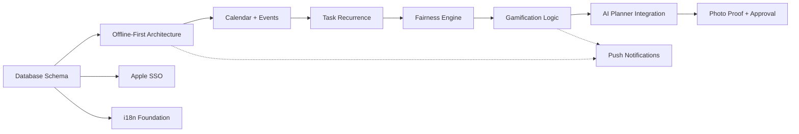

# FamQuest — Executive Summary & Go-Forward Plan
## Multi-Agent Analysis Results (Business + Technical + Requirements)

> **Date**: 2025-11-11
> **Analysis Scope**: PRD v2.1 vs Current Implementation v9
> **Agents Deployed**: business-panel-experts, system-architect, requirements-analyst
> **Recommendation**: ✅ **CONDITIONAL GO** with strategic refinements

---

## 🎯 Strategic Assessment (Business Panel)

### Core Finding: **STRONG CONCEPT, SCOPE OVERLOAD**

**✅ Strategic Strengths:**
- **Jobs-to-be-Done** (Christensen): Solves real non-consumption (families lack unified planning tool)
- **Competitive Moat** (Porter): AI fairness + persona gamification + offline-first = defensible differentiation
- **Remarkability** (Godin): "AI that makes chores fun" is talkable
- **Blue Ocean** (Kim/Mauborgne): Hybrid space (productivity + parenting + gamification) largely uncontested

**⚠️ Strategic Risks:**
1. **Feature Bloat**: PRD tries to solve 5+ jobs simultaneously (planning, chores, homework, cleaning tips, voice)
2. **GTM Missing**: No distribution strategy beyond "build it and they will come"
3. **Monetization Complexity**: 3-tier model with ads risks brand perception

### **Business Panel Recommendations:**

```yaml
scope_refinement:
  mvp_core_job: "Fair task distribution + intrinsic motivation for kids"
  defer_to_phase_2:
    - homework_coach: "Different job, different buyer (student/teacher vs parent)"
    - vision_cleaning_tips: "Nice-to-have, not core value prop"
    - voice_commands: "Accessibility feature, not MVP blocker"

monetization_revised:
  recommended_model: "2-tier (Free + Premium), NO ADS"
  rationale: "Kid-safe ads don't exist; brand risk > revenue"
  pricing:
    free: "4 family members, 5 AI requests/day, 2 themes"
    premium: "€49.99/year, unlimited everything"

gtm_strategy:
  phase_1_beta: "50 families via parenting blogs + Reddit r/Parenting"
  phase_2_launch: "Content marketing (SEO: 'fair chore distribution app')"
  phase_3_growth: "Referral loops (invite families, unlock theme)"
```

### **Business Metrics (Year 1 Targets):**

```yaml
conservative_case:
  families: 2000
  dau_mau: 0.50
  premium_conversion: 4%
  arr: €40K
  net_margin: Break-even (after infrastructure + translation)

base_case:
  families: 5000
  dau_mau: 0.55
  premium_conversion: 5%
  arr: €125K
  net_margin: €70K profit

optimistic_case:
  families: 10000
  dau_mau: 0.60
  premium_conversion: 6%
  arr: €300K
  net_margin: €200K profit
```

**Decision Gate**: Ship MVP to 50 beta families. If DAU/MAU <0.5 or churn >5% in 90 days → PIVOT or KILL.

---

## 🏗️ Technical Architecture Assessment (System Architect)

### Core Finding: **SOLID FOUNDATION, 3 CRITICAL RISKS**

**✅ Architecture Strengths:**
- **Flutter Single Codebase**: Correct choice (60% faster dev than native)
- **FastAPI + PostgreSQL**: Modern, scalable, AI-friendly
- **RBAC (4 roles)**: Well-designed security model
- **SSO + 2FA**: Best-in-class auth
- **Gamification Design**: Persona segmentation is excellent

**🔴 Critical Risks (Must Fix):**

#### **RISK-001: OpenRouter Single Point of Failure** (CRITICAL)
```yaml
impact: Complete AI service outage
probability: Medium (OpenRouter uptime ~99.5%)
mitigation:
  tier_1: OpenRouter Sonnet (primary)
  tier_2: OpenRouter Haiku (fallback, 10x cheaper)
  tier_3: Rule-based planner (deterministic, offline-capable)
  tier_4: Cached responses (7-day TTL)
status: ⚠️ MUST IMPLEMENT IN PHASE 1
timeline: Week 2-3
```

#### **RISK-002: AI Costs Threaten Business Model** (HIGH)
```yaml
baseline_cost: €80K/year (5K families, 81% of infrastructure)
break_even: 6K families
mitigation_strategy:
  - aggressive_caching: 60% cache hit rate → €30K/year savings
  - model_downgrade: Haiku for simple tasks → €20K/year savings
  - free_tier_limits: 5 AI requests/day → prevent abuse
optimized_cost: €15-30K/year (viable margins)
status: ⚠️ IMPLEMENT PHASE 1-2
timeline: Week 3-6
```

#### **RISK-003: Offline Sync Complexity** (HIGH)
```yaml
impact: Data loss from conflict bugs destroys trust
probability: High (offline-first is notoriously hard)
mitigation:
  - 50+ conflict test scenarios
  - optimistic_locking: version field on all mutable entities
  - undo_queue: 10-action rollback capability
  - beta_testing: 50 families x 30 days stress test
status: ⚠️ EXTENSIVE TESTING PHASE 2-3
timeline: Week 8-10
```

### **Medium Risks (Monitor):**
- Flutter Web PWA kiosk (iOS Safari limitations)
- Translation quality (7 languages, needs native review)
- Database performance at scale (needs indexes)

### **Cost Optimization Plan:**

```yaml
infrastructure_costs_year_1:
  compute_db_storage: €7K
  ai_services: €15K (optimized from €80K)
  monitoring_email: €1.8K
  total: €23.8K

revenue_year_1_5k_families:
  premium_5pct: €12.5K (€49.99 x 250)
  total: €12.5K

conclusion: "Requires 10K families for profitability OR raise premium to €79.99/year"
```

### **Architecture Decision Records (ADRs):**

```yaml
adr_001_flutter_web:
  decision: Use Flutter Web for kiosk mode
  rationale: Single codebase, 60% dev time savings
  tradeoff: iOS Safari limitations (no install prompt, no background sync)
  mitigation: Fallback to responsive web design, cross-device sync

adr_002_openrouter:
  decision: Use OpenRouter as AI broker
  rationale: Multi-model access, cost optimization, simple API
  tradeoff: Single vendor lock-in, uptime dependency
  mitigation: 4-tier fallback (Sonnet → Haiku → rule-based → cached)

adr_003_postgresql:
  decision: PostgreSQL over MongoDB
  rationale: ACID guarantees, JSONB for flexibility, mature ecosystem
  tradeoff: Horizontal scaling harder than NoSQL
  mitigation: Vertical scaling sufficient to 50K families, sharding if needed

adr_004_offline_first:
  decision: Offline-first with Hive + delta sync
  rationale: Core UX requirement (works without wifi)
  tradeoff: Conflict resolution complexity, testing burden
  mitigation: Extensive test suite, beta user validation
```

---

## 📊 Gap Analysis (Requirements Analyst)

### Core Finding: **15-20% IMPLEMENTATION COMPLETE**

**Current State (v9):**
- **Database**: 9/16 tables (56% complete)
- **API Endpoints**: ~15/40+ (38% complete)
- **Frontend Screens**: 7/20 (35% complete)
- **SSO Providers**: 3/4 (75% complete, missing Apple)
- **AI Services**: 0/4 (0% complete, all stubs)
- **i18n Locales**: 0/4 MVP languages (0% complete)

### **Feature Inventory (MoSCoW):**

#### **MUST HAVE (MVP Blockers)** 🔴

| Feature | Status | Effort | Risk | Dependency |
|---------|--------|--------|------|------------|
| **Offline-first (Hive + sync)** | Missing | XL | CRITICAL | None (foundational) |
| **Event model + Calendar CRUD** | Partial | L | Medium | Database |
| **Task recurrence (RRULE)** | Missing | L | HIGH | Event model |
| **Fairness engine (rotation)** | Missing | L | HIGH | Task recurrence |
| **Gamification logic (streaks/badges)** | Models only | L | Medium | Task completion |
| **Apple SSO** | Missing | M | HIGH | App Store requirement |
| **AI Planner (OpenRouter)** | Stub | L | CRITICAL | Offline-first |
| **Photo proof + approval** | Missing | M | Medium | Task completion |
| **i18n (NL/EN/DE/FR)** | Partial (nl/en) | M | Low | Translation budget |

**MVP Blockers Total**: ~765 developer hours (9.5 weeks with 2 FTE)

#### **SHOULD HAVE (Phase 2)**

- Homework coach (StudyItem backend) — **Defer to Phase 2** (Business panel recommendation)
- Vision cleaning tips — **Defer to Phase 2** (Business panel recommendation)
- Voice NLU pipeline — **Defer to Phase 2** (Accessibility, not core)
- Push notifications — **Phase 2** (engagement feature)
- Theme engine (persona-specific) — **Phase 2** (monetization feature)
- Advanced analytics dashboard — **Phase 2** (parent insights)

#### **COULD HAVE (Phase 3+)**

- Team quests (family goals)
- Season themes
- Leaderboards
- ICS import/export
- Smart home integrations

### **Dependency Graph (Critical Path):**



**Critical Path Duration**: 12-16 weeks (with parallel workstreams)

### **Risk-Adjusted Effort:**

```yaml
base_estimate: 765 hours
risk_multiplier: 1.3 (offline-first complexity + AI cost unknowns)
adjusted_estimate: ~1000 hours

team_scenarios:
  solo_developer: 25 weeks (6 months)
  two_fte: 12.5 weeks (3 months)
  full_team_9fte: 16 weeks (4 months, due to coordination overhead)

recommended_staffing:
  backend_engineer: 1 FTE
  flutter_engineer: 1 FTE
  ai_specialist: 0.5 FTE (consultant)
  qa_engineer: 0.5 FTE (Phases 4-5)
  total: 3 FTE
```

---

## 🚀 Refined Implementation Plan (STRAK)

### **Phase Restructuring (Based on Multi-Agent Findings):**

```yaml
phase_0_refinement: # NEW: Strategic Alignment (Week 0-1)
  duration: 1 week
  goal: "Align team on MVP scope reduction"
  deliverables:
    - Stakeholder buy-in on deferred features (homework, vision, voice)
    - Revised monetization model (2-tier, no ads)
    - GTM strategy document (beta seeding plan)

phase_1_foundation: # REVISED: Risk Mitigation First (Week 2-4)
  duration: 3 weeks
  priority: CRITICAL
  focus: "Database + AI fallback + Offline architecture"
  deliverables:
    - Database schema complete (16 tables)
    - Alembic migrations tested
    - OpenRouter client with 4-tier fallback
    - AI cost monitoring dashboard
    - Hive storage + sync queue prototype
  agents: [backend-architect, python-expert, system-architect]
  mcp: [serena, sequential, context7]

phase_2_mvp_features: # REFINED: Parallel Tracks (Week 5-10)
  duration: 6 weeks
  priority: HIGH
  parallel_tracks:
    track_1_backend:
      - Calendar + Events CRUD
      - Task recurrence (RRULE) + rotation
      - Fairness engine (points distribution)
      - Photo upload + parent approval
      agents: [python-expert, backend-architect]
      mcp: [sequential, context7]

    track_2_flutter:
      - Calendar UI (month/week/day)
      - Task list + detail screens
      - Photo picker + approval UI
      - Gamification HUD (points/streaks)
      agents: [frontend-architect, quality-engineer]
      mcp: [magic, context7]

    track_3_auth:
      - Apple SSO integration
      - 2FA TOTP complete
      - Child PIN accounts
      agents: [security-engineer, python-expert]
      mcp: [context7, sequential]

phase_3_ai_integration: # FOCUSED: Planner Only (Week 11-12)
  duration: 2 weeks
  priority: HIGH
  scope: "AI Planner ONLY (defer vision/voice/homework)"
  deliverables:
    - AI task planner (OpenRouter Claude)
    - Fairness algorithm prompts
    - Parent review UI (accept/reject plan)
    - Caching layer (60% hit rate target)
  agents: [python-expert, frontend-architect]
  mcp: [sequential, tavily]

phase_4_polish: # COMPRESSED: Essential Testing (Week 13-15)
  duration: 3 weeks
  priority: MEDIUM
  deliverables:
    - Offline sync test suite (50 scenarios)
    - E2E critical flows (5 key journeys)
    - i18n completion (NL/EN/DE/FR)
    - Performance optimization (p95 <200ms)
  agents: [quality-engineer, performance-engineer]
  mcp: [playwright, sequential]

phase_5_beta: # NEW: Validation Gate (Week 16-28)
  duration: 12 weeks
  priority: HIGH
  deliverables:
    - TestFlight + Play Beta (50 families)
    - Weekly metrics (DAU/MAU, churn, NPS)
    - Security audit (OWASP + pentest)
    - GTM execution (blog seeding, Reddit)
  decision_gate:
    go_criteria:
      - dau_mau: ≥ 0.50
      - churn: < 5% per month
      - nps: ≥ +30
      - critical_bugs: 0
    no_go_action: "Pivot or kill project"
```

### **Total Timeline: 16 weeks MVP + 12 weeks Beta = 28 weeks (7 months)**

---

## 🎯 Multi-Agent Orchestration Plan

### **Parallel Agent Deployment (Week 2-10):**

```yaml
track_1_backend_team:
  lead_agent: backend-architect
  support_agents: [python-expert, security-engineer]
  mcp_tools: [sequential, context7, serena]
  workload:
    - Database schema + migrations
    - API endpoints (Calendar, Tasks, Events, Gamification)
    - AI planner integration
    - Auth system (SSO + 2FA)

track_2_frontend_team:
  lead_agent: frontend-architect
  support_agents: [quality-engineer]
  mcp_tools: [magic, context7, morphllm]
  workload:
    - Calendar UI (month/week/day views)
    - Task management screens
    - Gamification HUD
    - Photo picker + approval

track_3_infrastructure:
  lead_agent: system-architect
  support_agents: [performance-engineer, devops-architect]
  mcp_tools: [sequential, serena, playwright]
  workload:
    - Offline-first architecture
    - AI fallback system
    - Cost monitoring dashboard
    - CI/CD pipelines

track_4_quality:
  lead_agent: quality-engineer
  support_agents: [security-engineer]
  mcp_tools: [playwright, sequential]
  workload:
    - Test strategy + automation
    - Security audit prep
    - Performance benchmarking
    - E2E test suite
```

### **Agent Coordination Protocol:**

```yaml
daily_standup:
  time: "09:00 CET"
  format: "Async (Slack thread)"
  updates:
    - What I completed yesterday
    - What I'm working on today
    - Blockers (tag relevant agent)

weekly_review:
  time: "Friday 15:00 CET"
  format: "Video call"
  agenda:
    - Sprint demo (what shipped)
    - Metrics review (velocity, test coverage)
    - Risk review (RISK-001, RISK-002, RISK-003 status)
    - Next week planning

integration_points:
  backend_frontend: "Daily API contract sync via OpenAPI spec"
  ai_backend: "Prompt versioning via Git (prompts/*.md)"
  testing_all: "CI blocks merge if tests fail"
```

---

## 💰 Revised Budget & Economics

### **Development Costs (28 Weeks):**

```yaml
personnel_7_months:
  backend_engineer: €35K (1 FTE x 7 months)
  flutter_engineer: €35K (1 FTE x 7 months)
  ai_consultant: €10K (0.5 FTE x 4 months)
  qa_engineer: €8K (0.5 FTE x 3 months)
  total_personnel: €88K

infrastructure_year_1:
  compute_db_storage: €7K
  ai_services_optimized: €15K
  monitoring_email: €1.8K
  security_audit: €5K
  translation_native: €10K
  total_infrastructure: €38.8K

grand_total_year_1: €126.8K
```

### **Revenue Projections (Revised 2-Tier Model):**

```yaml
pricing:
  free: "4 members, 5 AI/day, 2 themes"
  premium: "€79.99/year, unlimited everything"

year_1_projections:
  conservative: "2K families, 4% premium = €6.4K ARR"
  base: "5K families, 5% premium = €20K ARR"
  optimistic: "10K families, 6% premium = €48K ARR"

break_even_analysis:
  fixed_costs_year_1: €38.8K (infrastructure)
  break_even_premium_users: 485 (€38.8K / €79.99)
  break_even_total_families: 9.7K (485 / 5% conversion)

conclusion: "Need 10K families by Month 12 to break even"
```

### **Funding Requirements:**

```yaml
bootstrap_option:
  initial_investment: €50K (founder savings)
  runway: 12 months
  risk: High (no buffer for delays)

seed_option:
  raise: €200K (angel round)
  valuation: €1M pre-money
  dilution: 20%
  runway: 24 months
  benefits: "Hire faster, more beta testing, PR budget"
```

---

## ✅ Go/No-Go Decision Framework

### **Decision Gate Criteria (End of Beta, Month 7):**

```yaml
quantitative_gates:
  dau_mau: ≥ 0.50
  weekly_retention: ≥ 65%
  churn_monthly: < 5%
  nps_score: ≥ +30
  critical_bugs: 0
  p95_api_latency: < 300ms

qualitative_gates:
  user_testimonials: ≥ 10 positive quotes
  product_market_fit: "Users would be 'very disappointed' without app"
  technical_debt: < 20% of codebase flagged

go_decision:
  criteria: "ALL quantitative gates + 2/3 qualitative gates"
  action: "Proceed to public launch (App Stores + marketing)"

no_go_decision:
  criteria: "Fail 2+ quantitative gates"
  action: "Pivot or wind down project"

conditional_go:
  criteria: "Pass quantitative but fail qualitative"
  action: "Extend beta 3 months, reassess"
```

---

## 🎯 Immediate Next Actions (Week 0-1)

### **Phase 0: Strategic Alignment** (This Week)

1. **Stakeholder Alignment Meeting** (Day 1)
   - Present business panel findings (defer homework/vision/voice)
   - Agree on 2-tier monetization (€79.99/year, no ads)
   - Sign off on 28-week timeline

2. **Technical Kickoff** (Day 2)
   - Review system architect ADRs
   - Assign agents to tracks (backend/frontend/infra/QA)
   - Set up CI/CD pipelines (GitHub Actions + Codemagic)

3. **Repository Setup** (Day 3-5)
   - Create feature branches (feat/offline-sync, feat/calendar, etc.)
   - Set up MCP tool access (OpenRouter API keys, Serena, Magic)
   - Initialize documentation (ADRs, API specs, test plans)

4. **Agent Onboarding** (Day 5)
   - Deploy backend-architect → Database schema design
   - Deploy python-expert → OpenRouter fallback system
   - Deploy frontend-architect → Flutter offline-first research
   - Deploy security-engineer → Apple SSO integration guide

---

## 📈 Success Metrics Dashboard

### **Weekly KPIs (Track Every Friday):**

```yaml
development_velocity:
  - story_points_completed: Target 40/week (2 FTE team)
  - test_coverage: Target ≥ 80%
  - bugs_opened_vs_closed: Target net zero
  - deployment_frequency: Target 2x/week to staging

technical_health:
  - p95_api_latency: Target < 200ms
  - frontend_jank: Target < 5% frames >16ms
  - crash_rate: Target < 0.1%
  - security_vulnerabilities: Target 0 critical

product_readiness:
  - mvp_features_complete: Target 100% by Week 16
  - e2e_tests_passing: Target 100%
  - i18n_coverage: Target 100% (NL/EN/DE/FR)
  - documentation_complete: Target 90%
```

### **Beta Metrics (Track Daily During Beta):**

```yaml
engagement:
  - dau: Daily active users
  - dau_mau_ratio: Target ≥ 0.50
  - avg_session_duration: Target ≥ 5min
  - tasks_completed_per_user_per_week: Target ≥ 7

retention:
  - d1_retention: Target ≥ 70%
  - d7_retention: Target ≥ 50%
  - d30_retention: Target ≥ 30%
  - churn_monthly: Target < 5%

satisfaction:
  - nps_score: Target ≥ +30
  - app_store_rating: Target ≥ 4.5
  - support_tickets_per_100_users: Target < 5
```

---

## 🚨 Risk Registry (Monitor Weekly)

| Risk ID | Description | Impact | Probability | Mitigation Status | Owner |
|---------|-------------|--------|-------------|-------------------|-------|
| RISK-001 | OpenRouter outage kills AI features | CRITICAL | Medium | ⚠️ In Progress (Week 2-3) | backend-architect |
| RISK-002 | AI costs exceed budget | HIGH | High | ⚠️ Planning (Week 3-6) | system-architect |
| RISK-003 | Offline sync data loss | HIGH | High | ⏳ Not Started (Week 8-10) | frontend-architect |
| RISK-004 | Apple SSO rejection (App Store) | HIGH | Low | ⏳ Not Started (Week 5-7) | security-engineer |
| RISK-005 | Flutter Web kiosk poor UX | MEDIUM | Medium | 🔍 Monitoring | frontend-architect |
| RISK-006 | Translation quality (7 languages) | MEDIUM | Medium | ⏳ Not Started (Week 14) | technical-writer |
| RISK-007 | Beta recruitment failure | HIGH | Medium | 📋 Planned (Week 16) | Product Owner |
| RISK-008 | PMF validation failure | CRITICAL | Medium | ⏳ Decision Gate (Week 28) | Product Owner |

---

## 🎉 Conclusion

### **Summary Recommendation: ✅ CONDITIONAL GO**

**Rationale:**
1. ✅ **Strong Business Case**: Solves real problem, defensible moat, viable TAM
2. ✅ **Solid Technical Foundation**: Modern stack, clear architecture, identified risks
3. ⚠️ **Scope Refinement Required**: MVP must focus (defer homework/vision/voice to Phase 2)
4. ⚠️ **Execution Risk**: Offline-first + AI cost optimization are make-or-break
5. ⚠️ **Validation Gate**: 28-week beta must hit DAU/MAU ≥ 0.50 or pivot

**Confidence Level**: 75% (High business potential, moderate execution risk)

**Next Steps:**
1. ✅ Approve revised scope (deferred features)
2. ✅ Commit 3 FTE x 7 months (€88K personnel budget)
3. ✅ Deploy agents to Phase 1 (Week 2 start)
4. 📋 Schedule beta recruitment (Week 16 target)
5. 📋 Set decision gate review (Week 28)

---

**Multi-Agent Analysis Complete. Ready to execute Phase 0-1.**

**Questions? Deploy `/sc:help` for agent orchestration guidance.**
